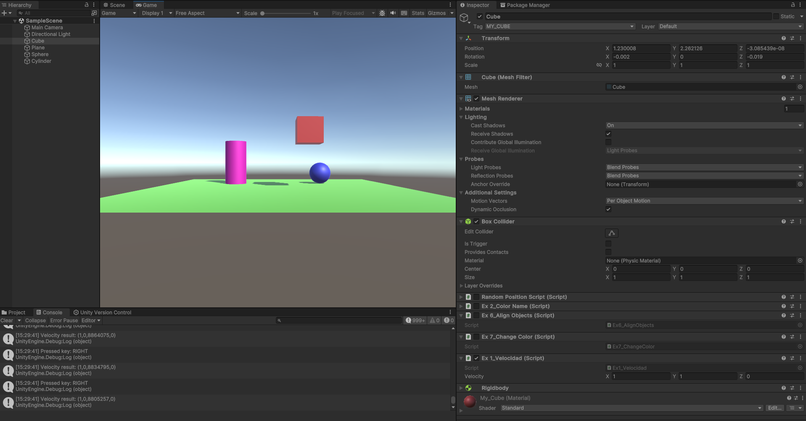
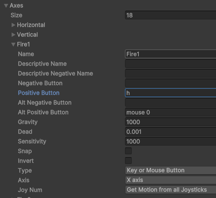
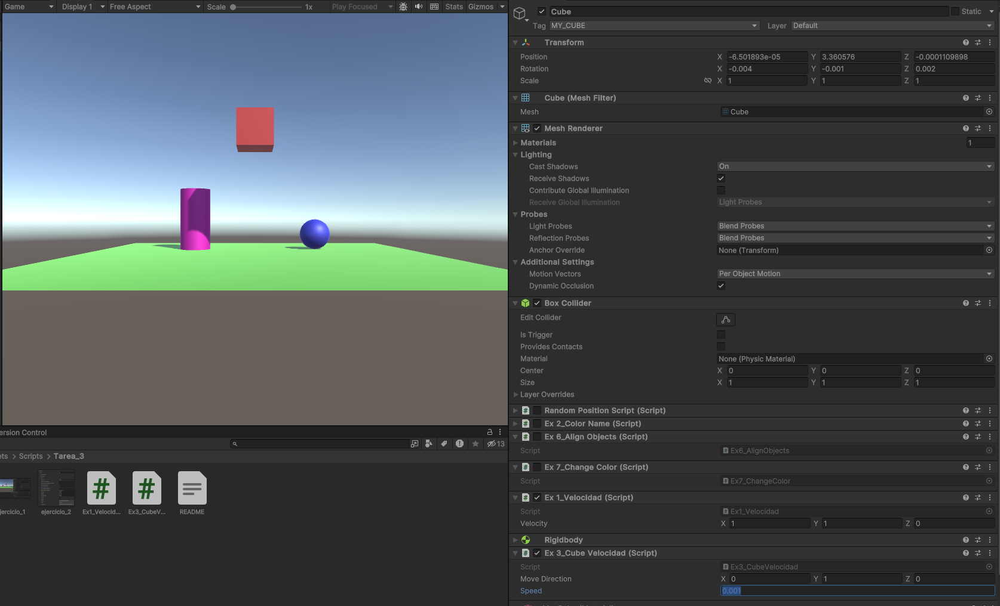
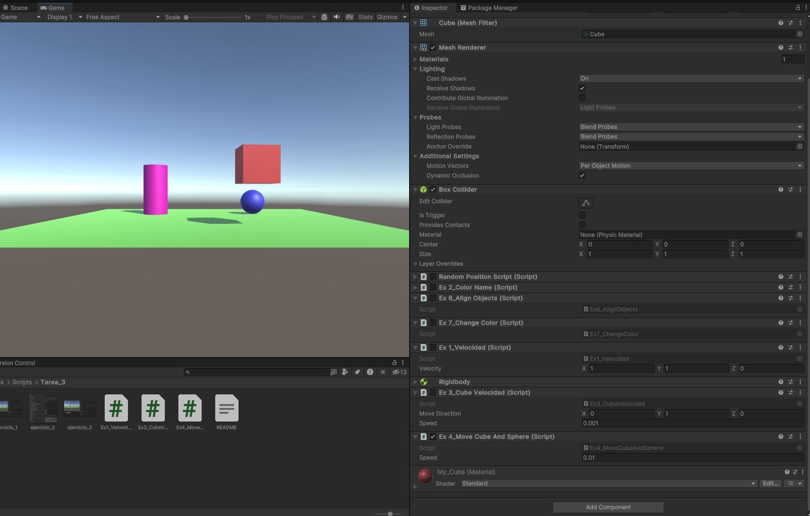

# Tarea3-Unity

## Ejercicio 1: Velocidad

El método Update() contiene la lógica: Cada vez que se pulsa una de las teclas de flecha, se muestra la velocidad actual con Debug.Log(). (ver script)

En el imagen se puede ver la consola con la velocidad y el Vector3 para configurar la velocidad.

## Ejercicio 2: Tecla H

En el menu del Input Manager, cambiar la configuración por defecto con la tecla H

## Ejercicio 3: Movimiento

En cada frame, se llama a `transform.Translate(moveDirection * speed)` (No estoy cierto que esto es correcto).

Tambièn es posible modificar los valores de `moveDirection` y `speed` en el insepctor porque son campos pùblicos.

Situaciones:

a. cuando duplicas los valores del `moveDirection`, el cubo se mueve el doble de rápido

b. también se mueve el doble de la velocidad.

c. solamente reduce la velocidad

d. no cambia el comportamiento

e. solamente un movimiento a direccion y: el cubo gira si se cambia a `Space.World`

## Ejercicio 4:

Primero obtengo los GameObjects con la etiqueta y cada vez que se pulsa una tecla coincidente, muevo la bola o el cubo.

## Ejercicio 5:

Lo mismo como ejercicio 4, solamente multiplicar los valores con `Time.deltaTime`.
Ahore el valor `speed` puede elegirse más grande porque este valor es mulitplicando con `Time.deltaTime`.

## Ejercicio 6:

El movimiento de la esfera con W-A-S-D sigue siendo el mismo, pero el movimiento del cubo he cambiado.
Primero calculo la diferencia de las posiciones y luego con "transform.Translate" muevo el cubo en esa dirección.

## Ejercicio 7:

El movimiento de la esfera se mantiene, sólo se añade `cube.transform.LookAt(sphere.transform)`.

## Ejercicio 8:

